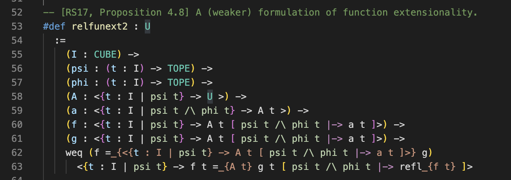

# rzk-1-experimental-highlighting README

This is a simple syntax highlighter for `rzk`, an experimental proof assistant for synthetic ∞-categories.

## Release Notes

### 0.0.1

Initial release of the Syntax Highlighter for rzk

### 0.0.2

Do not treat `<` and `>` as brackets in the extension.

### 0.2.0

Support `rzk` code blocks in Markdown files.

### 0.2.1

Add file icons for `.rzk` files.

### 0.2.2

Slight improvements in syntax highlighting.

### 0.2.3

Support syntax highlighting for most of rzk-v0.4.0

## v0.2.4 — 2022-05-27

Support syntax highlighting for `*.rzk.md` files

## v0.2.5 — 2022-06-11

1. Support syntax highlighting for `*.rzk.tex` files (see [#5](https://github.com/fizruk/vscode-rzk/pull/5)).
2. Add icons for literate Rzk files (both Markdown and TeX, see [#13](https://github.com/fizruk/vscode-rzk/pull/13)).
3. Some minor fixes (restoring rainbow-parentheses and keybinding for code commenting).
4. Using YAML for the language grammar (see [#6](https://github.com/fizruk/vscode-rzk/pull/6)).
5. Add `launch.json` and prettify (see [#1](https://github.com/fizruk/vscode-rzk/pull/1))
