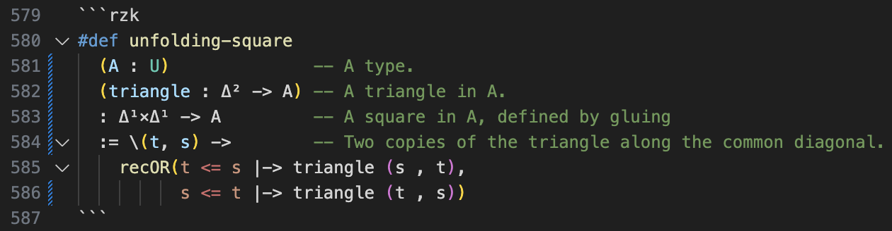
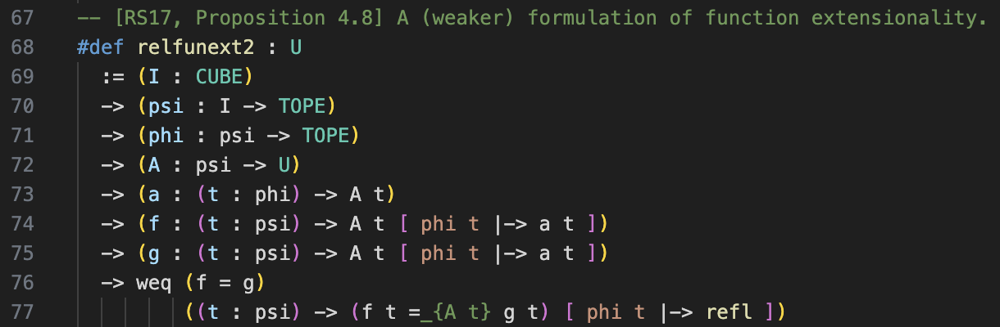

# Supporting Rzk in VSCode (`rzk-1-experimental-highlighting`)

Syntax highlighting for [`rzk`](https://rzk-lang.github.io/rzk/), an experimental proof assistant for synthetic ∞-categories.

Features:

1. Basic syntax highlighting with a simple TextMate grammar.
2. Semantic highlighting via `rzk tokenize` (you must have `rzk` in your PATH, with version v0.5 or above).
3. Prompts for installing/updating `rzk` binaries from GitHub Releases automatically (usable from local Terminal).
4. Markdown Preview button for `*.rzk.md` files.

See [Changelog](CHANGELOG.md) for recent updated and changes.

More examples:

## Configuration

Extension settings can be configured by going to the settings page (using the menu `File > Preferences > Settings`, or using the shortcut <kbd>CTRL + ,</kbd> on Windows/Linux or <kbd>⌘ + ,</kbd> on macOS).

The currently available settings are:

| Name                   | Type      | Default value | Description                                                                                                                                   |
| ---------------------- | --------- | ------------- | --------------------------------------------------------------------------------------------------------------------------------------------- |
| `rzk.path`             | `string`  | `""`          | The path to the `rzk` executable to use for the language server. `""` (default) means that `rzk` executable available in `PATH` will be used. |
| `rzk.fetchPrereleases` | `boolean` | `false`       | If true, will include releases marked as \"pre-release\" on GitHub when fetching the latest binaries.                                         |
